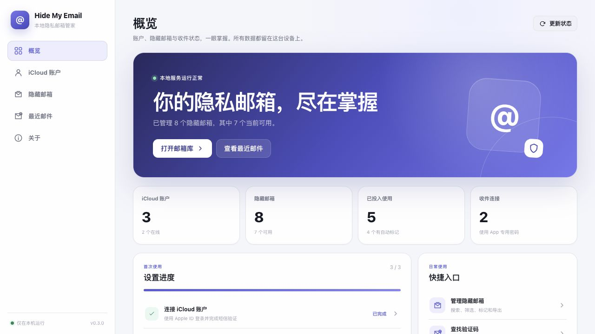
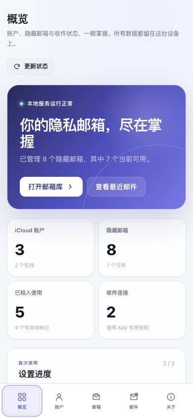

<div align="center">

# iCloud Hide My Email Manager

**A local-first desktop manager for multiple Apple IDs, Hide My Email aliases, and verification mail.**

[](#platform-support)
[](https://nodejs.org/)
[](https://www.electronjs.org/)
[](https://github.com/LYH105/iCloudEmail-Lite/actions/workflows/ci.yml)
[](https://github.com/LYH105/iCloudEmail-Lite/releases/latest)
[](LICENSE)

[中文说明](README.zh-CN.md) · English

</div>

The app runs on your computer, listens only on loopback, and stores its database, browser profiles, and encryption key locally. It combines account health, alias management, automatic marks, and a cross-alias inbox in one interface.

> This project uses Apple's private web APIs and is not affiliated with or endorsed by Apple. Screenshot accounts and addresses are isolated demo data.



<details>
<summary>More real screenshots from the v0.3 production build</summary>




</details>

## Core features

- **Guided setup and health overview** — see account, mailbox, and alias readiness without visiting every page.
- **Multiple Apple IDs** — direct SRP-6a login with an explicit SMS step; background recovery never sends an SMS by itself.
- **Hide My Email lifecycle** — create 1–25 aliases, choose the label, sync, deactivate, reactivate, delete, and update forwarding metadata.
- **Cross-account alias library** — search by address, account, label, note, or mark; filter by account/stage; track “used”; export the visible result as spreadsheet-safe CSV.
- **Unified recent mail** — read mail sent to any managed alias, extract likely verification codes and sign-in links, and optionally refresh while the page is visible.
- **Automatic marks** — rules can match sender, subject, or body, and can be imported, exported, renamed, or cleaned up.
- **Local security** — AES-256-GCM encrypted secrets, API-key scopes in browser/server mode, per-launch desktop session authentication, CSP, sandboxed email rendering, and blocked remote images by default.
- **Recoverable local mirror** — an incomplete Apple snapshot can hide an alias, but cannot destroy its local marks or “used” state.

## Project highlights

- Desktop mode is close to zero-configuration: it chooses a free loopback port, creates the encryption key, starts the backend, and opens the UI.
- A stale browser API key returns the user to the connection screen instead of leaving the app stuck on repeated 401 responses.
- Mail cache is isolated per backend/API key, bounded to 7 days and eight windows, and cleared on sign-out or authentication failure.
- Every Apple HTTP exchange, Playwright validation, IMAP connection, message, and aggregate mail pull has a bounded lifetime or memory budget.
- CI tests Node.js 24 across macOS Apple Silicon, macOS Intel, and Windows x64. The lockfile includes native packages for all release targets.

## Platform support

| | macOS | Windows |
| --- | --- | --- |
| Supported target | macOS 11+, Apple Silicon or Intel | Windows 10 1809+, x64 |
| Source launcher | `启动iCloud邮箱.command` | `启动iCloud邮箱.bat` |
| Browser helper | Google Chrome | Microsoft Edge |
| Release output | `.dmg` and `.zip` | NSIS `.exe` |

Installers must be built on their target operating system because the packaged Node runtime and SQLite binding are platform-specific.

## Installation

### Download a release

For normal use, download the package for your system from [GitHub Releases](https://github.com/LYH105/iCloudEmail-Lite/releases/latest). Releases are built for macOS Apple Silicon, macOS Intel, and Windows x64.

### Run from source

Requirements:

- Node.js **24 or newer**
- npm 10 or newer
- Google Chrome on macOS or Microsoft Edge on Windows for browser-assisted session refresh and “Open Apple page”

```bash
git clone https://github.com/LYH105/iCloudEmail-Lite.git
cd iCloudEmail-Lite
npm install
npm run doctor
npm run desktop
```

The launchers in the project root perform the same dependency check and desktop start. Mainland China users can use an Electron mirror during installation:

```bash
ELECTRON_MIRROR=https://registry.npmmirror.com/-/binary/electron/ npm install
```

## Quick start

1. Open the desktop app and choose **Add account**.
2. Enter the Apple ID, password, region, and whether the password may remain encrypted on this device.
3. Enter the SMS code Apple sends. Background jobs will never start this SMS step for you.
4. In the account editor, add an Apple **app-specific password** for IMAP. This is different from the Apple ID password.
5. Open **Alias library** to sync existing aliases, or create a labelled batch from the account page.
6. Open **Recent mail** to find messages, codes, and sign-in links across all aliases.

Apple app-specific passwords are created at [account.apple.com](https://account.apple.com/) under **Sign-In and Security → App-Specific Passwords**.

## Configuration

Desktop mode configures safe defaults automatically. For browser/server development, copy [`.env.example`](.env.example) to `.env`.

| Variable | Default | Purpose |
| --- | --- | --- |
| `HOST` | `127.0.0.1` | Listening host. Keyless mode is rejected on non-loopback hosts. |
| `PORT` | `8787` | Browser/server port; the desktop shell uses a free dynamic port. |
| `SECRET_MASTER_KEY` | development fallback | Required in production; encrypts sensitive SQLite fields. |
| `DATABASE_PATH` | `./data/icloud-hme.sqlite` | SQLite database location. |
| `PROFILES_DIR` | `./data/profiles` | Per-account browser profile directory. |
| `CORS_ORIGINS` | `http://localhost:5173` | Comma-separated browser origins allowed by the API. |
| `DISABLE_AUTH` | `false` | Local development only. Electron additionally requires a per-launch HttpOnly session cookie. |
| `SESSION_REFRESH_MINUTES` | `180` | Cookie/session refresh interval; `0` disables it. |
| `MARK_SCAN_MINUTES` | `30` | Automatic mark scan interval; `0` disables it. |
| `PLAYWRIGHT_CHANNEL` | platform default | `chrome`, `msedge`, or installed `chromium`. |
| `WEB_DIST` | unset | Built frontend directory when the backend serves the production UI. |

Never expose keyless mode to a LAN or the internet. The application rejects `DISABLE_AUTH=true` unless `HOST` is loopback.

## Usage examples

### Browser development mode

```bash
npm run dev
```

Open `http://localhost:5173`. The first visit creates a scoped API key; copy it immediately because its plaintext value is shown only once.

### Production web build

```bash
npm run build
SECRET_MASTER_KEY="$(node -e "process.stdout.write(require('crypto').randomBytes(32).toString('base64'))")" \
WEB_DIST=../iCloudEmail-FrontEnd/dist NODE_ENV=production npm start
```

### Create the first browser-mode API key

```bash
curl -X POST http://127.0.0.1:8787/api/apikeys \
  -H 'Content-Type: application/json' \
  -d '{"name":"local browser","scopes":["read","write"]}'
```

After bootstrap, send `Authorization: Bearer <key>` on API requests. The last active write-capable key cannot be revoked or deleted.

## Data and backups

| Data | macOS | Windows |
| --- | --- | --- |
| App data | `~/Library/Application Support/@icloud-hme/desktop/` | `%APPDATA%\@icloud-hme\desktop\` |
| Database | `…/data/icloud-hme.sqlite` | `…\data\icloud-hme.sqlite` |
| Browser profiles | `…/data/profiles/` | `…\data\profiles\` |
| Encryption key | `…/master.key` | `…\master.key` |
| Backend logs | `…/logs/` | `…\logs\` |

Back up the whole app-data directory, not only SQLite. If an existing database is present but `master.key` is missing or invalid, the desktop app refuses to start instead of silently creating an incompatible key.

## Project structure

```text
iCloudEmail-Lite/
├── iCloudEmail-Desktop/          Electron lifecycle, secure window, child server, packaging
├── iCloudEmail-BackEnd/
│   ├── src/api/                  Fastify routes, auth, validation, error envelope
│   ├── src/services/             Account, alias, mark, IMAP, overview, scheduler logic
│   ├── src/icloud/               SRP, Apple auth, HME client, browser session refresh
│   ├── src/imap/                 Bounded IMAP fetch and code/link extraction
│   ├── src/db/                   SQLite schema and migrations
│   └── test/                     API, migration, security, sync, and policy tests
├── iCloudEmail-FrontEnd/
│   ├── src/components/           Shared icons and error boundary
│   ├── src/features/             Account, alias, and mail feature modules
│   ├── src/pages/                Overview and route-level screens
│   └── test/                     Pure UI business-logic tests
├── scripts/                      Dev orchestration, doctor, and metadata checks
├── .github/workflows/            Cross-platform CI and tagged releases
└── docs/                         Real screenshots from the current production build
```

## Development and builds

```bash
npm run doctor              # environment and native-module diagnostics
npm run dev                 # backend + Vite frontend
npm run check               # metadata, formatting, lint, types, tests, production build
npm run audit:dependencies  # high-severity dependency audit
npm run package:mac         # unpacked macOS app, on macOS
npm run package:win         # unpacked Windows app, on Windows
npm run dist:mac            # signed/notarized when credentials are supplied
npm run dist:win            # NSIS installer
```

Tagged `v*` pushes run the release workflow and publish checksummed artifacts. Signing credentials are optional for local builds but recommended for public distribution.

## FAQ and troubleshooting

**Why does login require an SMS code?**

A new Apple client is not trusted yet. The SMS step is explicit and interactive; session keep-alive and automatic recovery never send one.

**Apple ID password or app-specific password?**

The Apple ID password creates the HME web session. The app-specific password reads forwarded mail over IMAP. They are configured separately.

**Why does the app say the saved password is missing?**

You opted out of storing it, cleared it later, or restored a database without a valid encrypted value. Enter it again for an explicit login.

**Why is mail empty?**

Confirm the account has an app-specific password, use the Apple ID receiving the forwarded mail as IMAP username, and press **Refresh**. Large/attachment-heavy messages are skipped to protect memory.

**Why does a synced alias disappear and later return?**

Apple occasionally returns incomplete snapshots. Missing aliases are hidden rather than destroyed; local marks and “used” state are restored if the alias returns.

**`better-sqlite3` cannot load its native binding.**

Use Node.js 24+ and run `npm install` on the current operating system. If the repository was copied with `node_modules`, remove those dependency directories and reinstall.

**macOS blocks an unsigned local build.**

Right-click the app and choose **Open**, or build with your Developer ID credentials. Do not disable system-wide Gatekeeper protections.

**Can this run on a public server?**

That is not the supported use case. Browser/server mode supports scoped API keys, but Apple credentials, mail, and local browser profiles make a single-user loopback deployment the intended security model.

## Security and privacy notes

- Secrets are encrypted at rest; API keys are hashed and never stored in plaintext.
- Email HTML is rendered in a sandbox with scripts disabled. Remote images require explicit opt-in and are HTTPS-only.
- API/health responses use `no-store`; the production UI receives CSP, referrer, permissions, and MIME-sniffing protections.
- Mail parsing limits each message to 2 MiB and each pull to 24 MiB of source data.
- Deleting an account also removes its local profile, but only after verifying the path remains inside the configured profiles directory.

## License and disclaimer

[MIT](LICENSE). Apple, iCloud, Hide My Email, macOS, and related marks belong to Apple Inc. Private APIs can change without notice; use the project with accounts and data you are authorized to manage.
