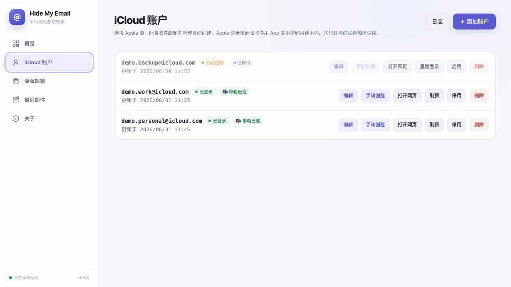
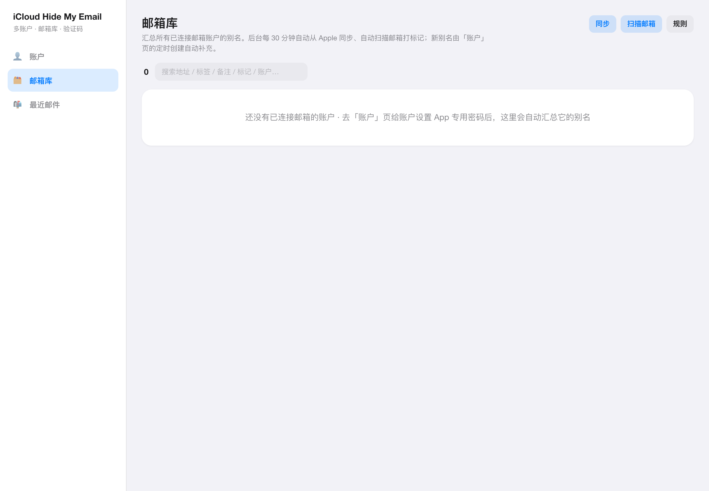
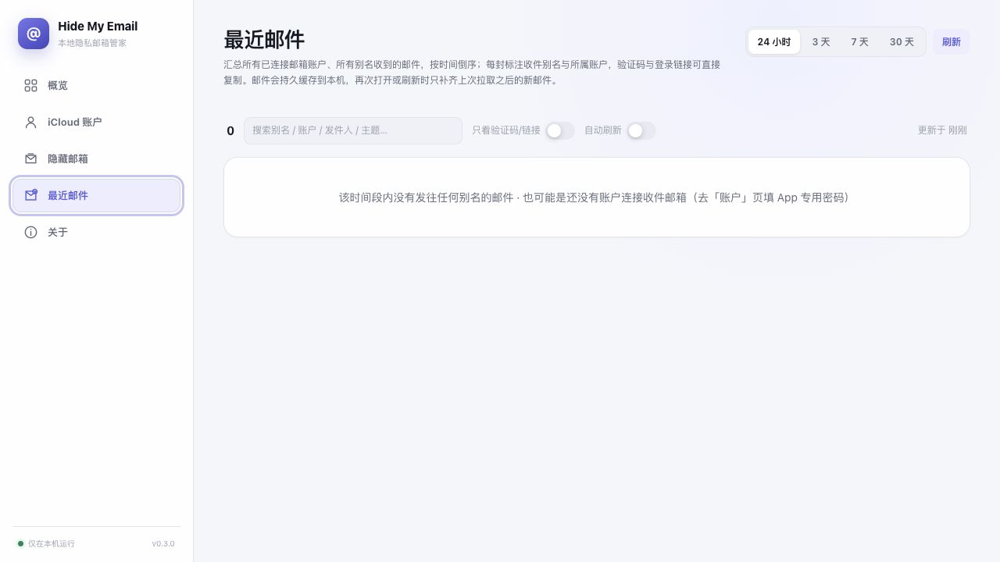

<div align="center">

# iCloud Hide My Email 多账户管理系统

**跨平台（macOS / Windows）本地桌面应用** —— 多 Apple ID 登录、Hide My Email 别名批量管理、跨别名收件与验证码提取，全部数据只存在你自己的电脑上。

[](#平台支持)
[](https://nodejs.org/)
[](https://www.electronjs.org/)
[](#安全说明)
[](LICENSE)
[](https://github.com/LYH105/iCloudEmail-Lite/releases/latest)
[](https://github.com/LYH105/iCloudEmail-Lite/stargazers)

中文 · [English](README.md)

**觉得好用的话，点个 ⭐ Star 支持一下** —— 也方便你下次直接从「Your stars」里找回来。

</div>

---

对接 Apple iCloud Web / Hide My Email（HME）接口的自托管管理系统。支持多账户登录会话、别名的**生成 / 预留 / 停用 / 重新启用 / 删除 / 改标签备注**、API Key 鉴权，以及通过 IMAP 拉取验证码。所有对 Apple 的请求/响应字段与官方 Web 客户端**严格对齐**。

> **本项目面向本机桌面使用**：Electron 外壳内启后端，只监听 `127.0.0.1`，没有任何需要部署到服务器、暴露到公网的部分。

> 截图中的账户地址为演示用占位地址。



<details>
<summary>更多界面截图（邮箱库 / 最近邮件）</summary>

**邮箱库** —— 跨账户的别名池，支持搜索、按账户/标记筛选、「已用」开关、单别名收件：



**最近邮件** —— 跨所有别名的总收件箱，每封标注收件别名与所属账户，验证码和登录链接可直接复制：



</details>

## 目录

- [功能](#功能)
- [平台支持](#平台支持)
- [快速开始](#快速开始)
- [打包成安装包](#打包成安装包)
- [数据存放位置](#数据存放位置)
- [鉴权方式：SRP-6a 直接登录](#鉴权方式srp-6a-直接登录)
- [目录结构](#目录结构)
- [与 Apple API 的字段对齐](#与-apple-api-的字段对齐)
- [本系统的 REST API](#本系统的-rest-api)
- [登录流程说明](#登录流程说明)
- [IMAP 验证码](#imap-验证码)
- [安全说明](#安全说明)
- [开发自测](#开发自测)
- [支持一下](#支持一下)
- [免责声明](#免责声明)

## 功能

- **桌面应用（Electron）**：iOS 18 风格界面（Tailwind），内部启动后端并同源加载，**本地免 API Key**，双击即用。
- **多账户**：SRP 登录 + 短信验证码，Apple 信任令牌保存后约 30 天内可免 2FA 静默重登；会话过期时依次尝试 Cookie 静默刷新 → 存储密码 + 信任令牌无头重登 → 才提示重新验证。后台 session keeper 定期保活。
- **Hide My Email**：`generate` / `reserve` / `list` / `updateMetaData` / `deactivate` / `reactivate` / `delete` / `updateForwardTo`，本地镜像缓存；支持**一次批量生成 N 个**（默认 5），批量过程中会话过期会自动刷新 Cookie 后继续。
- **邮箱库**：跨账户的别名池，带搜索、按账户/标记筛选、「已用」开关、单别名收件，以及将**当前筛选结果导出为 CSV**；`aliasSyncScheduler` 后台自动同步。
- **最近邮件**：一个跨所有别名的总收件箱（`GET /api/aliases/mail-library`，默认最近 24h），每封标注所属别名，自动 + 手动刷新。
- **标记规则**：按发件人/主题等规则自动给别名打标（已注册/已开通…），`markScanner` 定期扫描收件箱套用；规则支持导入导出、重命名、清理孤儿标记。
- **API Key**：SHA-256 存储，read / write 作用域，首个 Key 免鉴权引导创建。
- **IMAP 验证码**：连接任意 IMAP（默认 iCloud `imap.mail.me.com:993`），拉取近期邮件并启发式提取验证码/登录链接，可按收件别名过滤。
- **敏感字段加密**：会话 Cookie、Apple ID 密码、IMAP 密码在 SQLite 中以 AES-256-GCM 加密存储。
- **版本检查**：「关于」页会比较当前版本与 GitHub 最新 Release，发现新版本时直接提供下载入口。

## 平台支持

同一套代码同时支持 macOS 与 Windows，差异只在下面这张表里：

|                    | macOS                                             | Windows                                     |
| ------------------ | ------------------------------------------------- | ------------------------------------------- |
| 系统要求           | macOS 11 Big Sur 及以上（Apple Silicon / Intel）  | Windows 10 (1809) 及以上，x64               |
| 双击启动脚本       | `启动iCloud邮箱.command`                          | `启动iCloud邮箱.bat`                        |
| 数据目录           | `~/Library/Application Support/@icloud-hme/desktop` | `%APPDATA%\@icloud-hme\desktop`             |
| Playwright 默认浏览器 | Google Chrome（`chrome`）                       | Microsoft Edge（`msedge`）                  |
| 打包命令           | `npm run dist:mac` → `.dmg` / `.zip`              | `npm run dist:win` → NSIS 安装包 `.exe`     |
| 菜单栏             | 原生菜单（⌘C / ⌘V / ⌘Q 可用）                     | 无菜单栏，快捷键在窗口内                    |

> **打包必须在目标系统上进行**：应用会随附一份 Node 运行时，`better-sqlite3` 也是原生模块，两者都与操作系统 + CPU 架构绑定。macOS 上打不出 Windows 包，反之亦然；Apple Silicon 上也打不出 Intel 包。

## 快速开始

### 1. 前置条件

- **Node.js ≥ 20**（[下载](https://nodejs.org/)）。
- 基于 Chromium 的浏览器：macOS 使用 **Google Chrome**，Windows 使用 **Microsoft Edge**。仅用于 Cookie 刷新和打开已登录的 Apple 页面；账户登录本身通过 SRP 完成，不会打开浏览器。

### 2. 安装依赖

```bash
npm install
```

### 3. 方式一：桌面应用（推荐）

```bash
npm run desktop      # 构建 server + web，然后启动 Electron 窗口
```

也可以在文件管理器里双击启动脚本：macOS 使用 `启动iCloud邮箱.command`，Windows 使用 `启动iCloud邮箱.bat`。

桌面应用会用系统 Node 子进程启动后端（固定 `127.0.0.1:8787`），并把界面同源加载进窗口。数据库、浏览器 profile、加密主密钥都存在系统的 userData 目录（见[数据存放位置](#数据存放位置)），主密钥首次运行自动生成并持久化。桌面模式为本地单用户，**免 API Key**。

### 4. 方式二：浏览器开发模式

```bash
npm run dev          # 同时起后端和前端（macOS / Windows 通用）
```

或者分开起：

```bash
npm run dev:server   # 后端 http://127.0.0.1:8787
npm run dev:web      # 前端 http://localhost:5173（已配置代理到后端）
```

浏览器模式首次打开会提示**创建第一个 API Key**（此时免鉴权）；此后所有接口都需携带该 Key，Key 只在创建时明文显示一次。

生产构建：`npm run build`（产出 `iCloudEmail-BackEnd/dist` 与 `iCloudEmail-FrontEnd/dist`）。设 `WEB_DIST=../iCloudEmail-FrontEnd/dist` 后 `npm start` 即可单端口同时托管 API 与界面。

可配置项见 [`.env.example`](.env.example)（端口、主密钥、会话保活间隔、Playwright 通道等），复制成 `.env` 后修改。

## 打包成安装包

产物统一输出到仓库根目录的 `release/`。

**macOS**（在 Mac 上执行）：

```bash
npm run package:mac   # 只产出可直接运行的 .app：release/mac-arm64/iCloud Email Manager.app
npm run dist:mac      # 产出 .dmg + .zip
```

如未配置 Apple Developer ID，本地生成的 macOS 安装包不会包含开发者签名。

**Windows**（在 Windows 上执行）：

```powershell
npm run package:win   # 免安装绿色版目录：release\win-unpacked\
npm run dist:win      # NSIS 安装包：release\iCloud.Email.Manager-0.2.1-win-x64.exe
```

## 数据存放位置

| 内容                     | macOS                                                        | Windows                                          |
| ------------------------ | ------------------------------------------------------------ | ------------------------------------------------ |
| SQLite 数据库            | `~/Library/Application Support/@icloud-hme/desktop/data/icloud-hme.sqlite` | `%APPDATA%\@icloud-hme\desktop\data\icloud-hme.sqlite` |
| 浏览器 profile（每账户） | `…/@icloud-hme/desktop/data/profiles/`                       | `…\@icloud-hme\desktop\data\profiles\`           |
| 加密主密钥               | `…/@icloud-hme/desktop/master.key`                           | `…\@icloud-hme\desktop\master.key`               |

- 开发运行和安装版**共用同一份数据**；卸载（NSIS 卸载 / 把 .app 拖进废纸篓）不会删除该目录，需要清空时手动删。
- 浏览器开发模式（`npm run dev`）不走 userData，数据落在 `iCloudEmail-BackEnd/data/`。
- 备份就是备份上面这个目录；**`master.key` 丢了等于所有加密字段作废**（需重新登录、重填 IMAP 密码）。

## 鉴权方式：SRP-6a 直接登录

后端实现了 Apple 的 **SRP-6a 登录**（[`iCloudEmail-BackEnd/src/icloud/srp.ts`](iCloudEmail-BackEnd/src/icloud/srp.ts)）：填 Apple ID + 密码 → 服务端完成 SRP 握手 → Apple 下发短信验证码 → 回填验证码即登录完成，**全程无浏览器窗口**。登录后提取会话 Cookie、发现 `premiummailsettings` 服务地址与 `dsid`，之后所有 HME 操作用这份 Cookie 直连 iCloud API（对齐 [maxktz/icloud-hidemyemail-generator](https://github.com/maxktz/icloud-hidemyemail-generator)）。

Playwright 只在两处出现：会话过期时的 **Cookie 刷新快路径**，以及「打开网页」（打开一个已登录的 Apple 页面，比如去生成应用专用密码）。

## 目录结构

```
iCloudEmail-Lite/
├─ iCloudEmail-Desktop/    Electron 桌面外壳 —— 应用本体，打包成 .app / .exe
│  ├─ main.cjs             开窗口、spawn 后端子进程、loadURL 到本地后端（含 mac/win 差异处理）
│  ├─ build-icon.icns      macOS 应用图标
│  ├─ build-icon.ico       Windows 应用图标
│  └─ scripts/             prepare-runtime.cjs：打包前把后端/前端/node 产物收进 .runtime
├─ iCloudEmail-BackEnd/    后端 (Node.js + TypeScript + Fastify + better-sqlite3)
│  ├─ src/
│  │  ├─ config.ts         环境配置
│  │  ├─ crypto/secrets.ts AES-256-GCM 字段加密 + API Key 哈希
│  │  ├─ db/index.ts       SQLite 连接 + 建表 + 增量迁移
│  │  ├─ icloud/
│  │  │  ├─ types.ts       与 Apple API 严格对齐的类型
│  │  │  ├─ srp.ts         SRP-6a 登录握手（无浏览器）
│  │  │  ├─ browser.ts     Playwright：Cookie 刷新快路径 / 打开已登录页面
│  │  │  ├─ hme.ts         HME 操作客户端（用 cookie 直连）
│  │  │  └─ constants.ts   端点 / UA / 常量
│  │  ├─ imap/             imapflow 客户端 + 验证码/登录链接提取
│  │  ├─ services/         accounts / aliases / apiKeys / imap / marks 业务层
│  │  │                    + 三个后台调度器
│  │  └─ api/              Fastify 路由 + API Key 中间件
│  └─ scripts/             browser-check / login-flow-check / api-smoketest (开发自测)
├─ iCloudEmail-FrontEnd/   前端 (React + Vite + TypeScript 管理台)
│  └─ src/pages/           账户 / 邮箱库 / 最近邮件 / API Key
└─ scripts/dev.mjs         跨平台并行启动前后端（替代 shell 的 `&`）
```

### 为什么是三个目录，而不是「前端 + 后端」两个

三者职责完全不同：

- **`iCloudEmail-FrontEnd/`** 是界面（React 打包出来就是一堆静态文件），它不知道「窗口」是什么。
- **`iCloudEmail-BackEnd/`** 是服务（Fastify + SQLite），它不知道「界面」长什么样。
- **`iCloudEmail-Desktop/`** 是把上面两样装起来的**外壳**：开一个 1300×920 的窗口、在后台 spawn 出后端进程、让窗口 `loadURL('http://127.0.0.1:8787/')`、把数据固定存到系统 userData 目录、关窗时收尾杀掉后端，以及用 electron-builder 打包出安装包。**没有它就没有桌面应用**，只剩「手动开命令行启后端、再自己去浏览器输地址」。

外壳还必须是独立的 npm 包：better-sqlite3 是原生模块，Electron 主进程与 Node 的 ABI 不同，所以后端**不跑在 Electron 里，而是 spawn 一个真正的 node 子进程**（打包时把 `node` / `node.exe` 一起随附）。electron / electron-builder 这两个大块头开发依赖也因此必须隔离在外壳里，不能混进后端的生产依赖树 —— 打包时后端依赖是按 `npm ls --omit=dev` 精确复制的，并且 `npmRebuild: false` 确保原生模块保持 Node ABI、不被按 Electron ABI 重建。

> npm 包名仍是 `@icloud-hme/server` / `/web` / `/desktop`（`--workspace` 用的是包名，与目录名无关）。打进安装包 resources 里也仍是短名 `server/`、`web/`。

## 与 Apple API 的字段对齐

HME 请求发往 `{webservices.premiummailsettings.url}` 下，查询参数携带 `clientBuildNumber`、`clientMasteringNumber`、`clientId`、`dsid`。

| 操作       | 方法 | 路径                      | 请求体                          | 响应                                                            |
| ---------- | ---- | ------------------------- | ------------------------------- | --------------------------------------------------------------- |
| 生成       | POST | `/v1/hme/generate`        | `{}`                            | `{ success, result: { hme } }`                                  |
| 预留       | POST | `/v1/hme/reserve`         | `{ hme, label, note }`          | `{ success, result: { hme: HmeEmail } }`                        |
| 列表       | GET  | `/v2/hme/list`            | —                              | `{ result: { hmeEmails, selectedForwardTo, forwardToEmails } }` |
| 改元数据   | POST | `/v1/hme/updateMetaData`  | `{ anonymousId, label, note? }` | `{ success }`                                                   |
| 停用       | POST | `/v1/hme/deactivate`      | `{ anonymousId }`               | `{ success }`                                                   |
| 重新启用   | POST | `/v1/hme/reactivate`      | `{ anonymousId }`               | `{ success }`                                                   |
| 删除       | POST | `/v1/hme/delete`          | `{ anonymousId }`               | `{ success }`                                                   |
| 改转发目标 | POST | `/v1/hme/updateForwardTo` | `{ forwardToEmail }`            | `{ success }`                                                   |

`HmeEmail` 字段（逐字对齐）：`origin`、`anonymousId`、`domain`、`forwardToEmail`、`hme`、`isActive`、`label`、`note`、`createTimestamp`、`recipientMailId`。

类型定义见 [`iCloudEmail-BackEnd/src/icloud/types.ts`](iCloudEmail-BackEnd/src/icloud/types.ts)。

## 本系统的 REST API

所有 `/api/*` 需在请求头携带 `Authorization: Bearer <API_KEY>`（或 `X-API-Key`）。变更类操作需 `write` 作用域，只读需 `read`。桌面模式下 `DISABLE_AUTH=true`，免鉴权。

```
GET    /health
GET    /api/config                     # {authDisabled} —— 是否本地免鉴权模式（免鉴权）

GET    /api/apikeys/bootstrap          # {needsBootstrap} —— 是否需要创建首个 Key（免鉴权）
POST   /api/apikeys                    # 创建 Key（无 Key 时免鉴权引导）
GET    /api/apikeys
POST   /api/apikeys/:id/revoke
DELETE /api/apikeys/:id

GET    /api/accounts
GET    /api/accounts/:id               # 轮询此接口查看登录进度（status）
POST   /api/accounts/login             # {appleId, password, label?, china?} → {accountId, status:'awaiting_code', phone}
POST   /api/accounts/:id/verify-code   # {code} 回填短信验证码，完成登录
POST   /api/accounts/:id/resend-code   # 重发验证码
POST   /api/accounts/:id/resume-code   # 恢复一个中断的验证码流程
POST   /api/accounts/:id/relogin       # 重新登录（不带 body 则用已存密码 + 信任令牌静默重登）
POST   /api/accounts/:id/recover       # 会话过期后的恢复：Cookie 刷新 → 静默重登
POST   /api/accounts/:id/settings      # 账户设置（标签、存储的密码、自动创建别名等）
POST   /api/accounts/:id/disabled      # 停用/启用该账户的后台任务
POST   /api/accounts/:id/open-page     # 用 Playwright 打开一个已登录的 Apple 页面
POST   /api/accounts/:id/imap          # 绑定该账户的 IMAP（应用专用密码）
POST   /api/accounts/:id/imap/test
DELETE /api/accounts/:id/imap
DELETE /api/accounts/:id

GET    /api/accounts/:id/aliases                       # 本地缓存
POST   /api/accounts/:id/aliases/sync                  # 从 iCloud 拉取并刷新
POST   /api/accounts/:id/aliases/generate              # → {hme}
POST   /api/accounts/:id/aliases/reserve               # {hme, label, note?}
POST   /api/accounts/:id/aliases                       # {label, note?} 生成+预留
POST   /api/accounts/:id/aliases/batch                 # {count, label?, note?} 批量生成 → {created[], errors[]}
POST   /api/accounts/:id/aliases/forward-to            # {forwardToEmail} 改转发目标
POST   /api/accounts/:id/aliases/:anonymousId/deactivate
POST   /api/accounts/:id/aliases/:anonymousId/reactivate
PATCH  /api/accounts/:id/aliases/:anonymousId/used     # {used} 标记「已用」
GET    /api/accounts/:id/aliases/:anonymousId/mail     # 收该别名的邮件（含验证码/登录链接提取）
POST   /api/accounts/:id/aliases/scan-marks            # 扫描该账户收件箱并套用标记规则
DELETE /api/accounts/:id/aliases/:anonymousId

GET    /api/aliases                     # 跨账户的全部别名（含标记）—— 邮箱库
GET    /api/aliases/mail-library?sinceMinutes=1440   # 跨别名总收件箱 —— 最近邮件
POST   /api/aliases/sync                # 同步所有已连邮箱的账户
POST   /api/aliases/scan-marks          # 全量扫描并套用标记规则

GET    /api/mark-rules                  # 标记规则的增删改查
POST   /api/mark-rules
PATCH  /api/mark-rules/:id
DELETE /api/mark-rules/:id
GET    /api/mark-rules/orphans          # 没有规则对应的孤儿标记
POST   /api/mark-rules/marks/rename     # {from, to}
DELETE /api/mark-rules/marks/:mark
GET    /api/mark-rules/export           # 规则导出 / 导入
POST   /api/mark-rules/import

GET    /api/imap
POST   /api/imap                        # {label, host, port?, secure?, username, password, accountId?}
POST   /api/imap/:id/test
GET    /api/imap/:id/codes?sinceMinutes=&limit=&filterTo=
POST   /api/imap/fetch                  # 一次性拉取（不落库凭证）
DELETE /api/imap/:id

GET    /api/auto-create-logs            # 自动创建别名的运行日志
```

示例（生成并预留一个别名）：

```bash
curl -X POST http://127.0.0.1:8787/api/accounts/$ACCOUNT_ID/aliases \
  -H "Authorization: Bearer $API_KEY" -H "Content-Type: application/json" \
  -d '{"label":"某网站注册","note":"2026-07"}'
```

## 登录流程说明

1. `POST /api/accounts/login`（前端「添加账户」，填 Apple ID + 密码）→ 服务端跑完 **SRP-6a** 握手，Apple 下发短信验证码，接口返回 `status: "awaiting_code"` 和收码手机号后四位。全程**不开浏览器窗口**。
2. `POST /api/accounts/:id/verify-code` 回填验证码（可 `resend-code` 重发）→ 拿到会话 Cookie 与信任令牌，发现 `dsid` 与 `premiummailsettings` 服务地址，状态变为 `active`。
3. 之后所有 HME 操作用加密持久化的 Cookie 直连 iCloud API；遇到 `401/421` 依次尝试：① Playwright 持久化 profile **静默刷新** Cookie；② 若在账户「编辑」里存了登录密码，则用**密码 + 信任令牌无头重登**（Apple 信任约 30 天内免 2FA）；③ 仍失败才标记 `session_expired`，此时需要重新输一次短信验证码。
4. 后台 session keeper 每 `SESSION_REFRESH_MINUTES` 分钟（默认 180）对每个账户跑一遍上述保活，尽量不让会话走到过期。

## IMAP 验证码

- iCloud 邮箱需使用**应用专用密码**（在 [appleid.apple.com](https://appleid.apple.com) 生成），服务器 `imap.mail.me.com:993`（TLS）。
- 提取器对 4–8 位数字打分，优先靠近 "verification/code/验证码/OTP" 等关键词、6 位、以及出现在主题中的候选。`filterTo` 可只看发往某个别名的邮件。

## 安全说明

- `SECRET_MASTER_KEY` 派生 AES-256-GCM 密钥，加密 iCloud 密码 / 会话 / IMAP 密码。**更换该密钥会使已存密文无法解密**（需重新登录/重填）。生产环境务必设置强随机值，不要用默认开发值。
- 账户「编辑」里可选存储的 **Apple ID 登录密码**（用于会话过期后自动登录）同样以 AES-256-GCM 加密存于本地 SQLite（桌面版主密钥在 userData 的 `master.key`）；桌面为本地单用户、免鉴权模式，风险可接受，不需要时可随时「清除登录密码」。
- API Key 以 SHA-256 存储，明文仅在创建时返回一次。
- **只监听 `127.0.0.1`，没有面向公网的部分**。所有 `/api/*` 一律需要 API Key（桌面模式下 `DISABLE_AUTH=true` 免），不存在任何免鉴权的对外入口。
- `.env`、`data/`（SQLite）已在 `.gitignore` 中，切勿提交。

## 开发自测

```bash
cd iCloudEmail-BackEnd
npx tsx scripts/browser-check.ts     # 验证 Playwright 能启动本机浏览器（Chrome/Edge/Chromium）
npx tsx scripts/login-flow-check.ts  # 无凭证跑通登录管线（headless 短超时，预期 error）
npx tsx scripts/api-smoketest.ts     # 用 Fastify inject 跑通鉴权/作用域/校验/路由
```

类型检查：`npm run typecheck`。

## 支持一下

这个项目是纯自用需求做出来的，开源出来是想让有同样需求的人少折腾一点。如果它帮到了你：

- ⭐ **点个 Star** —— 一秒钟的事，但对一个小项目来说是最实在的鼓励，也让更多同样在找这个东西的人能搜到它
- 🐛 用着不顺就提 [Issue](https://github.com/LYH105/iCloudEmail-Lite/issues)，报 Bug、提需求都欢迎
- 🔀 想到更好的实现方式，直接来 PR

<a href="https://github.com/LYH105/iCloudEmail-Lite/stargazers"></a>

## 免责声明

- 本项目是**非官方**的第三方工具，与 Apple Inc. 无任何关联，也未获其背书。Apple、iCloud、Hide My Email 是 Apple Inc. 的商标。
- HME 接口为 Apple **非公开**接口，字段依据官方 Web 客户端行为对齐（参见 [maxktz/icloud-hidemyemail-generator](https://github.com/maxktz/icloud-hidemyemail-generator)），Apple 变更时以其实际返回为准，本项目可能随时失效。
- `p68-maildomainws` 这类分片地址因账户而异，本系统通过 `validate` 动态发现 `premiummailsettings` 服务地址，不硬编码分片。
- 仅供管理**你自己拥有的** Apple 账户使用。使用本项目即表示你自行承担账户风险（包括但不限于 Apple 的风控与条款约束）。
- 本项目以 [MIT 许可证](LICENSE)开源：可自由使用、修改、分发乃至商用，唯一要求是保留版权声明与许可证原文。软件按「原样」提供，不含任何担保。
